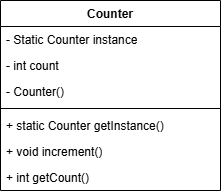

# Padrão de Projeto Singleton – Exemplo em Java

Este repositório apresenta uma implementação simples e útil do padrão de projeto **Singleton**, utilizando como exemplo um **contador global de acessos**.

---

## 📌 1. O que é o Singleton?

O Singleton é um padrão de projeto criacional que garante que **somente uma instância** de uma classe exista durante toda a execução da aplicação, além de fornecer um **ponto de acesso global** a essa instância.

---

## 📌 2. Problema que o Singleton resolve

Em algumas situações, várias partes de um sistema precisam acessar ou modificar um mesmo recurso global.  
Se cada classe criasse sua própria instância, isso geraria:

- valores inconsistentes  
- dificuldades de sincronização  
- desperdício de memória  
- conflitos de estado  

Exemplos práticos:

- log centralizado  
- configurações globais  
- contador de acessos  
- conexão única com banco de dados  

---

## 📌 3. Solução com Singleton

O Singleton resolve isso ao:

- tornar o construtor **privado**  
- criar uma **instância estática única**  
- retornar essa instância através de um método público (`getInstance()`)

Assim, toda a aplicação compartilha **exatamente o mesmo objeto**.

---

## 📘 4. Diagrama UML

